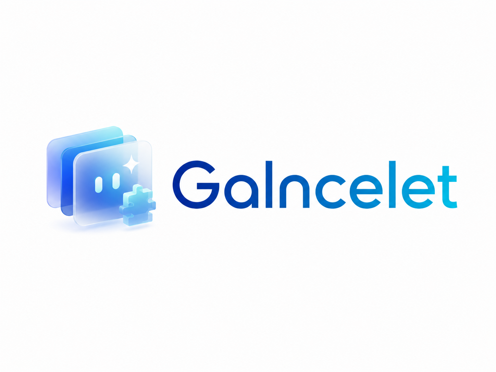

<p align="center">
  
</p>

<p align="center">
  <strong>AI 友好的 Windows 桌面挂件框架，支持完全热插拔 Runtime Addons。</strong>
</p>

<p align="center">
  <a href="https://github.com/sparrived/galncelet/releases"></a>
  <a href="https://github.com/sparrived/galncelet/actions"></a>
  
  
</p>

---

## Highlights

- **桌面挂件**：透明无边框窗口、毛玻璃视觉、贴边悬浮和系统托盘控制。
- **窗口感知**：自动检测当前前台窗口，挂件可贴附到目标窗口右侧。
- **内置挂件**：Git 状态、AMKR 仪表盘、音乐播放器、系统监控、剪贴板历史和页面笔记。
- **热插拔扩展**：用户直接放入或删除 addon 文件夹即可启用、禁用和卸载挂件。
- **独立后端能力**：Runtime Addons 可声明 sidecar，以 JSON-RPC 方式提供外部后端能力。
- **发布自动化**：版本构建、离线安装包和 GitHub Release 可通过脚本或 Action 固化执行。

## Screenshots & Branding

<p align="center">
  
</p>

应用图标使用 `assets/brand/galncelet-logo.png`，README 和发布页建议使用 `assets/brand/galncelet-full-logo.png`。

## Installation

从 [GitHub Releases](https://github.com/sparrived/galncelet/releases) 下载最新安装包。

- 在线安装包适合已具备 Windows WebView2 Runtime 的设备。
- Offline 安装包面向全新 Windows 11 主机，随安装包提供必要运行环境。
- 如果手动运行源码版本，请先安装 Node.js、Rust、Git 和 Visual Studio Build Tools。

## Development

推荐环境：

- **Windows 11**
- **Node.js 22+**
- **Rust stable**
- **Git**
- **Visual Studio Build Tools 2022**，包含 C++ 桌面开发工作负载和 Windows SDK

常用命令：

```bash
npm install
npm run tauri dev
npm run tauri build
```

仅构建前端：

```bash
npm run build
```

## Runtime Addons

Galncelet 的 Runtime Addons 以文件夹为边界独立加载，不需要重新编译主程序：

```text
%APPDATA%\Galncelet\addons\<addon-id>\
├── manifest.json
├── widget.html
├── widget.js
└── sidecar.exe      # 可选：外部后端能力
```

开发入口：

- [Runtime Addons 说明](docs/runtime-addons.md)
- [插件开发指南](docs/plugin-dev/README.md)
- [Manifest 规范](docs/plugin-dev/manifest.md)
- [Sidecar / 后端能力](docs/plugin-dev/backend.md)
- [AI 插件脚手架参考](docs/ai-reference/plugin-scaffold.md)

## Project Structure

```text
├── assets/brand/              # Logo 与 README 品牌资源
├── docs/                      # 发布、插件和 Runtime Addons 文档
├── scripts/                   # 发布与辅助脚本
├── src/                       # React 前端与内置挂件
├── src-tauri/                 # Tauri/Rust 桌面端
└── .github/workflows/         # GitHub Actions 发布流水线
```

## Release

本地发布：

```bash
npm run release
npm run release:offline
npm run release:publish
```

Action 发布：

1. 更新版本号和变更说明。
2. 推送 `vX.Y.Z` tag。
3. GitHub Actions 自动构建 Release 产物。

更多细节见 [Release Playbook](docs/release-playbook.md)。

## License

当前仓库未声明开源许可证。发布或复用前请先补充明确的 `LICENSE` 文件。
